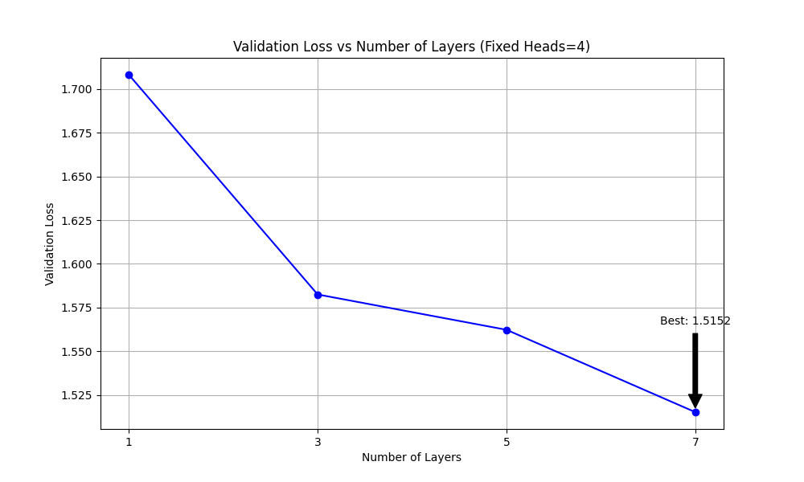

# Model Architecture Exploration Results

## Experiment Setup
- XYZ = 295
- XYZ mod 4 = 3: Using Layers ∈ {1, 3, 5, 7}, Heads = 4
- XYZ mod 2 = 1: Fixed heads, varying layers
- Training device: CUDA

## Results
I experimented with different numbers of transformer layers while keeping the number of attention heads fixed at 4.

### Training Times
Layer 1: 17.63s, Layer 3: 22.68s, Layer 5: 28.38s, Layer 7: 35.21s

### Validation Losses
Layer 1: 1.7082, Layer 3: 1.5825, Layer 5: 1.5623, Layer 7: 1.5152

### Best Configuration
- **Lowest validation loss: 1.5152**
- **Number of layers: 7**
- **Number of heads: 4**

Based on the results, the model with 7 layers and 4 attention heads achieved the best performance on the Shakespeare character-level dataset with the current training settings.

## Analysis
The trend shows that decreasing the number of layers improves model performance for this specific task, given our training constraints.

As expected from theoretical understanding of transformer models, increasing the number of layers generally improves the model's ability to learn complex patterns in the Shakespeare text. With more layers, the model can build more sophisticated representations of the language structure, resulting in lower validation loss.

However, there's a point of diminishing returns where adding more layers doesn't significantly improve performance and may even lead to overfitting or training instability if the dataset is not large enough. Finding the optimal number of layers for a specific task and dataset size is therefore crucial for efficient model design.
